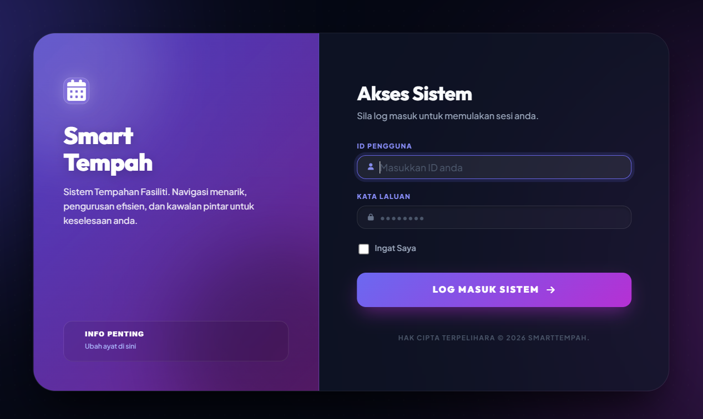
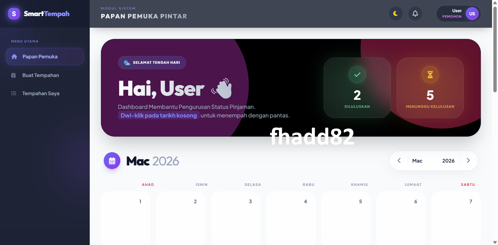
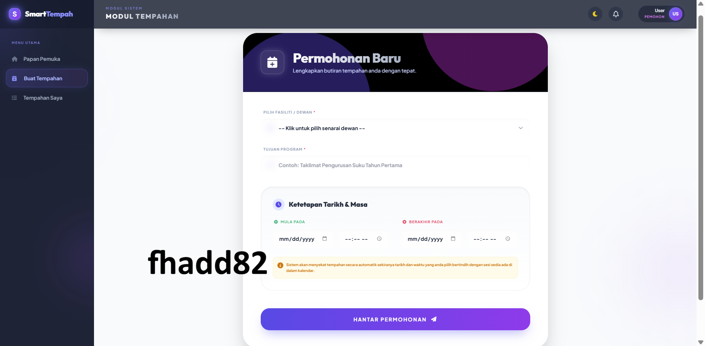
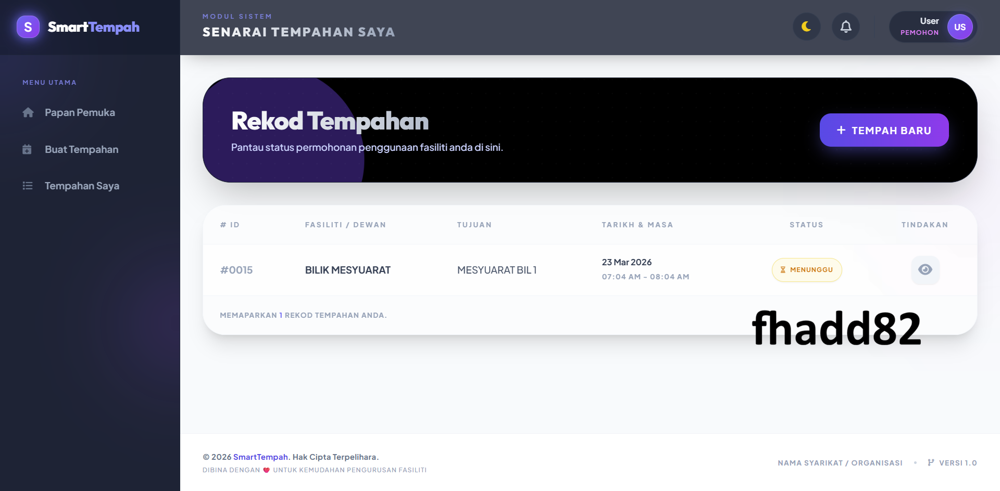
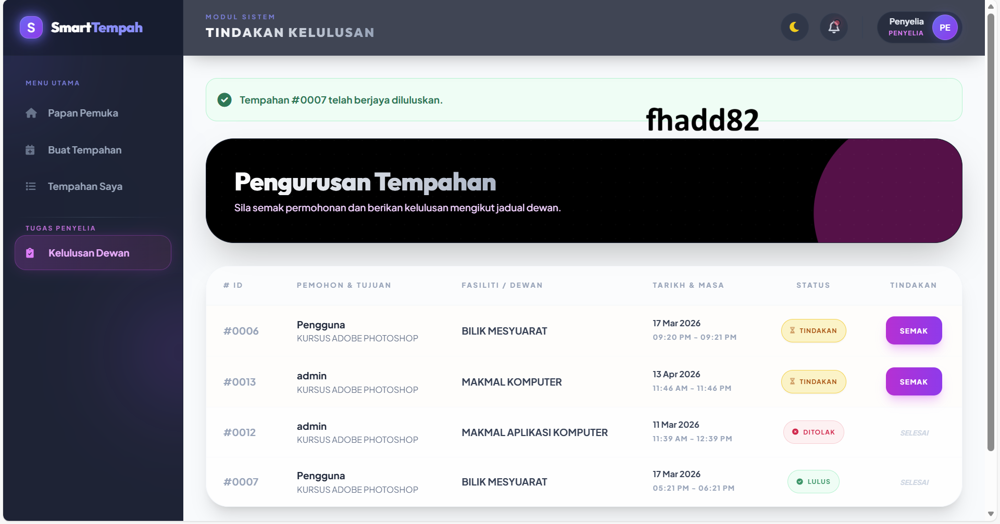
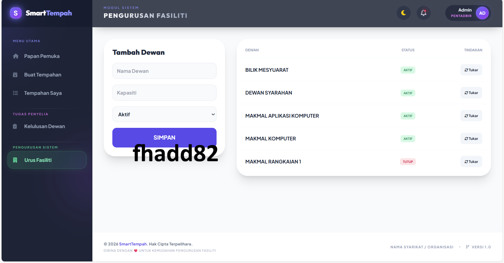

# 📘 SmartTempah / Sistem Tempahan Dewan

## 1. Pengenalan / Introduction

**Bahasa Malaysia:**  
SmartTempah ialah sistem web berasaskan PHP untuk mengurus tempahan dewan dengan mudah dan efisien. Pengguna boleh daftar akaun, semak dewan tersedia, membuat tempahan, dan menjejaki status tempahan. Admin boleh lulus permohonan, urus dewan, dan jana laporan tempahan. Sesuai untuk sekolah, dewan komuniti, masjid, hotel, dan tempat acara.

**English:**  
SmartTempah is a PHP-based web system for managing hall bookings efficiently. Users can register, check available halls, book slots, and track their bookings. Admins can approve requests, manage halls, and generate booking reports. Ideal for schools, community centers, mosques, hotels, and event venues.

---

## 2. Features / Ciri-ciri Utama

- ✅ User login / login pengguna  
- ✅ View available halls / Lihat dewan tersedia  
- ✅ Book hall & check booking status / Tempah dewan & semak status  
- ✅ Supervisor approval & management / Lulus permohonan & urus dewan  
- ✅ Calendar view for bookings / Paparan kalendar tempahan

Premium
- ✅ Generate booking reports / Jana laporan tempahan
- ✅ Smart Suggession / Cadangan Slot Automatik
- ✅ QR Code Ticket / Tiket QR Code tempahan
- ✅ Email notifications / Notifikasi melalui emel
- ✅ SuperAdmin Menu
      - Audit Trail / Log Audit
      - Analytics Dashboard / Analitik & Carta Papan Muka
      - Block Dates / Mod Selenggara
  
---

## 3. Screenshot / Contoh Paparan

| Login Page | User Dashboard | Tempahan Baru | Senarai Tempahan |
|------------|----------------|----------------|----------------|
|  |  |  |   |

| Supervisor / Penyelia |
|-----------------|
|  |


| Admin Dashboard |
|-----------------|
|  |

---

## 4. Installation / Panduan Pemasangan

### Requirements / Keperluan:
- PHP 7.4+  
- MySQL / MariaDB  
- Apache / XAMPP / WAMP  

### Steps / Langkah-langkah:

1. **Clone repository:**

```bash
git clone https://github.com/username/SmartTempah.git

2. **Import Database**
mysql -u root -p hall_booking < database/hall_booking.sql

3. Update Config :-
<?php
$host = "localhost";
$db = "hall_booking";
$user = "root";
$pass = "";
$conn = new mysqli($host, $user, $pass, $db);
?>

4. Run Project
http://localhost/SmartTempah

5. Default Login

Admin
Username: admin
Password: admin

Supervisor
Username: penyelia
Password: penyelia

User
Username: user
Password: user


